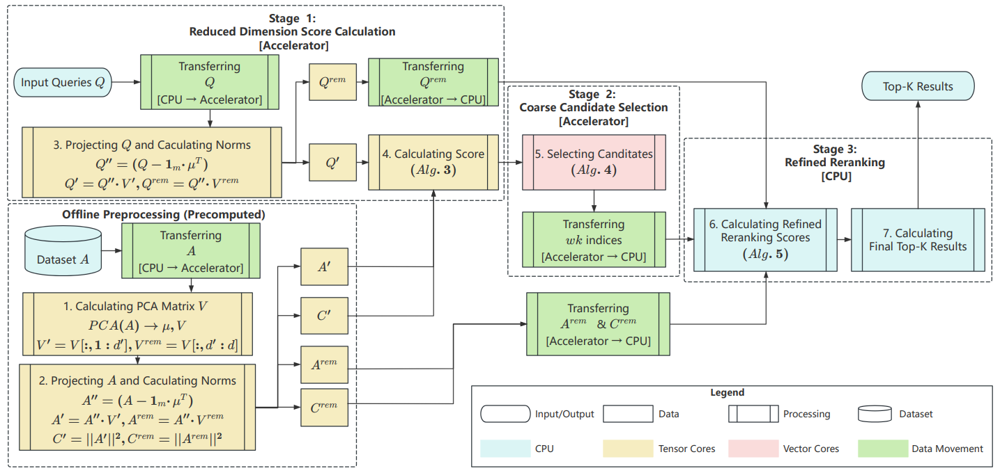

# TriH-ANNS Guide

## 1. Project Overview

TriH-ANNS is a high-performance GPU-accelerated system for 
similarity search in high-dimensional vector spaces.

## 2.  System Flow



## 3. Directory Structure & Module Tour

```
TriH-ANNS/
├── trih/                           # Core implementation
│   ├── src/                        # Host code (CPU algorithms)
│   │   ├── main.cu                 # Application entry point
│   │   ├── pca.{cpp,h}            # PCA computation and indexing
│   │   ├── data.{cpp,h}           # Dataset loading (HDF5/binary)
│   │   ├── gpu_pca_anns.{cu,cuh}  # GPU worker implementation
│   │   ├── search.{cpp,h}         # Search algorithms
│   │   ├── rerank.{cpp,h}         # CPU reranking logic
│   │   └── utils.{cpp,h}          # Utilities and helpers
│   ├── gpu/                        # Device code (GPU kernels)
│   │   ├── l2mm.{cu,cuh}          # L2 distance matrix kernels
│   │   ├── pca.{cu,cuh}           # GPU PCA projection kernels
│   │   ├── reduce_min.{cu,cuh}    # Top-K selection kernels
│   │   └── rerank.{cu,cuh}        # GPU-assisted reranking
│   ├── include/                    # Third-party headers
│   │   ├── cutlass/               # CUTLASS tensor library
│   │   └── cute/                  # CuTe tensor abstraction
│   └── eigen-3.4.0/               # Eigen linear algebra library
├── test/                           # Test scripts and data
├── empirical_validation_of_theoretical_results/  # Research validation
├── complete_proof/                 # Theoretical proofs (PDF)
├── anns_results/                   # Benchmark results
└── build/                          # CMake build artifacts
```

## 4. Quick-Start Example

### Build Index
```bash
# Build PCA index with 128 components
./trih/bin/trih_anns sift-128-euclidean-shuffle.hdf5 b sift_128 128 0.9

# Parameters:
# - sift-128-euclidean-shuffle.hdf5: dataset file
# - b: build mode
# - sift_128: index tag/name
# - 128: number of PCA components to retain
# - 0.9: variance ratio (alternative to fixed components)
```

### Search Queries
```bash
# Run search with optimized parameters
./trih/bin/trih_anns sift-128-euclidean-shuffle.hdf5 s sift_128 1000 300 100 128 4 16 16 0

# Parameters explanation:
# - s: search mode
# - sift_128: index tag to load
# - 1000: query batch size
# - 300: phase 1 top-k candidates
# - 100: phase 2 final results
# - 128: reduce group size for GPU operations
# - 4: number of worker processes
# - 16: batches per worker
# - 16: CPU reranking thread pool size
# - 0: use quant to get higher qps
```

## 5. Common Workflows

### Build System
```bash
# Clean rebuild
rm -rf build
cmake --preset TriH_configure -DCMAKE_BUILD_TYPE=Release
cmake --build build -j$(nproc)

# Debug build with logging(May lead to significant errors)
cmake --preset TriH_configure -DCMAKE_BUILD_TYPE=Debug -DENABLE_DETAILED_LOG=ON
cmake --build build -j$(nproc)

# Release build (default, optimized)
cmake --preset TriH_configure -DCMAKE_BUILD_TYPE=Release
cmake --build build -j$(nproc)
```

### Testing & Benchmarking
```bash
# Comprehensive benchmark suite
./batch_process_search_test.sh

# Individual dataset testing
../trih/bin/trih_anns gist-960-euclidean.hdf5 b gist_128 128 0.9
../trih/bin/trih_anns gist-960-euclidean.hdf5 s gist_128 1000 300 100 128 4 16 16 0
```